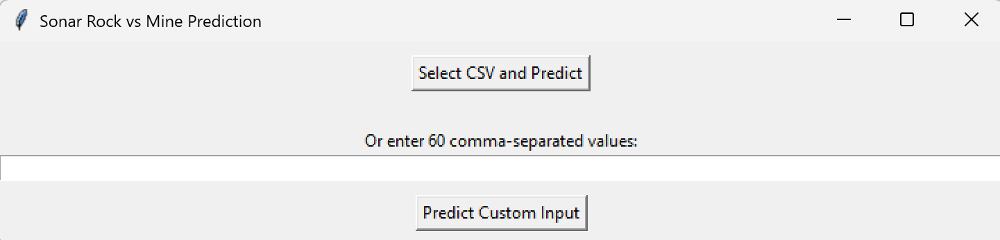
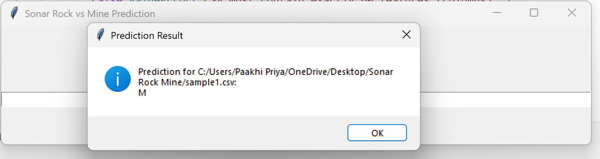
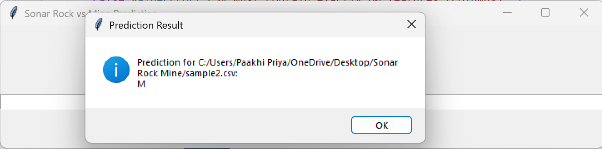
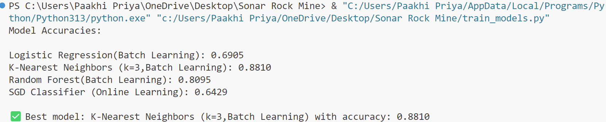
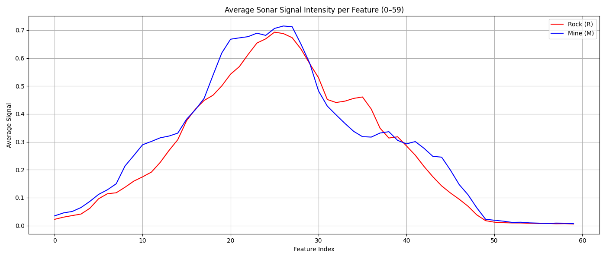

# Sonar Signal Prediction using Batch vs Online Machine Learning Models

This project focuses on predicting whether a sonar signal reflects off a rock or a mine using machine learning. It compares batch learning models like Logistic Regression, K-Nearest Neighbors (KNN), and Random Forest with an online learning model—Stochastic Gradient Descent Classifier (SGD). The best-performing model is then used to power a Tkinter GUI for CSV-based input prediction.

---

## Problem Statement

The task is to classify sonar signals as either R (Rock) or M (Mine) based on 60 numerical features extracted from the signal. The goal is to train and compare multiple ML models, identify the most accurate one, and use it in a user-friendly interface for making predictions.

---

## Solution Approach

- Split the `pre-processed clean sonar.csv` dataset.
- Train 4 classifiers:
  - Batch Learning: Logistic Regression, K-Nearest Neighbors (k=3), Random Forest
  - Online Learning: SGD Classifier
- Compare models based on accuracy.
- Save trained models using joblib.
- Use the best model in a GUI built with Tkinter for real-time prediction from sample CSV files or user input.
- Visualize model accuracy comparison and sonar feature distribution using pandas, matplotlib, and seaborn.

---

## Tech Stack

### Languages:
- Python

### Libraries and Modules:
- scikit-learn
- pandas
- joblib
- matplotlib
- seaborn
- tkinter

---

## Model Comparison

All models are trained and evaluated on the same dataset split. Accuracy scores are computed, and a bar graph is generated to compare their performance visually.

---

## GUI Functionality

The GUI allows users to:
- Upload and predict sonar signal results from sample CSV files.
- Enter 60 comma-separated values manually for prediction.
- View the predicted output based on the best trained model.

---
## How to Run Locally

```bash
# 1. Clone the Repository
git clone https://github.com/paakhipriya10/Sonar-Vs-RockMine-Prediction.git
cd Sonar-Vs-RockMine-Prediction
 ```

```bash
# 2. Install Python (if not already installed)
# Visit: https://www.python.org/downloads/
```
```bash
# 3. Install Required Libraries
pip install pandas numpy matplotlib seaborn scikit-learn joblib
```
```bash
# 4. Train the Models
python train_models.py
```
```bash
# 5. Run the GUI
python ml_gui.py
```
```bash
# 6. Provide Input
# → The GUI will  load/upload and predict:
# → You can also enter 60 comma-separated values manually in the GUI
 ```

---

##Future Improvements
- Replace Tkinter with a web-based UI using Flask or Streamlit  
- Deploy the project on Render or Heroku  
- Add automated hyperparameter tuning (e.g., GridSearchCV)  
- Explore Deep Learning alternatives for improved accuracy  
- Use real-time sonar signal input (IoT integration)  
- Package the app with an installer for non-technical users

---

## Output Screenshots:

### GUI Interface and Predictions
  
  
  

### Model Accuracy Comparison Visualizations
  
  

